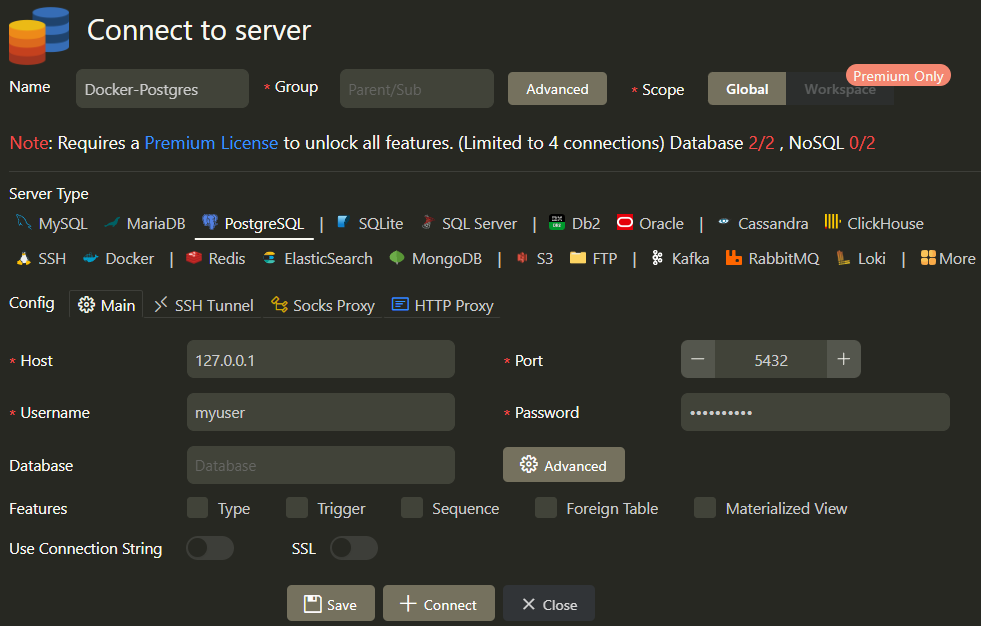

<p align="center">
  <a href="http://nestjs.com/" target="blank"></a>
</p>

[circleci-image]: https://img.shields.io/circleci/build/github/nestjs/nest/master?token=abc123def456
[circleci-url]: https://circleci.com/gh/nestjs/nest

<a href="https://www.npmjs.com/~nestjscore" target="_blank"></a>
<a href="https://www.npmjs.com/~nestjscore" target="_blank"></a>
<a href="https://www.npmjs.com/~nestjscore" target="_blank"></a>
<a href="https://circleci.com/gh/nestjs/nest" target="_blank"></a>
<a href="https://coveralls.io/github/nestjs/nest?branch=master" target="_blank"></a>
<a href="https://discord.gg/G7Qnnhy" target="_blank"></a>
<a href="https://opencollective.com/nest#backer" target="_blank"></a>
<a href="https://opencollective.com/nest#sponsor" target="_blank"></a>
  <a href="https://paypal.me/kamilmysliwiec" target="_blank"></a>
    <a href="https://opencollective.com/nest#sponsor"  target="_blank"></a>
  <a href="https://twitter.com/nestframework" target="_blank"></a>
</p>

---

# 🚀 **Configuración y funcionamiento en Windows 11**

---

## **Índice**

- [🚀 **Configuración y funcionamiento en Windows 11**](#-configuración-y-funcionamiento-en-windows-11)
  - [**Índice**](#índice)
  - [**Pasos para Instalar NestJS CLI Globalmente y ejecutar el proyecto:**](#pasos-para-instalar-nestjs-cli-globalmente-y-ejecutar-el-proyecto)
    - [1. **Instalar NestJS CLI:**](#1-instalar-nestjs-cli)
    - [2. **Verificar la Instalación:**](#2-verificar-la-instalación)
    - [3. **Descargar dependencias:**](#3-descargar-dependencias)
    - [4. **Ejecutar el proyecto:**](#4-ejecutar-el-proyecto)
  - [**Docker**](#docker)
    - [1. **Instalar Docker**](#1-instalar-docker)
    - [2. **Descargar la imagen de PostgreSQL:**](#2-descargar-la-imagen-de-postgresql)
  - [3. **Base de Datos**](#3-base-de-datos)
    - [1. **Ejecutar migraciones:**](#1-ejecutar-migraciones)
    - [2. **Ejecutar seeders:**](#2-ejecutar-seeders)
  - [4. **Documentación de la API**](#4-documentación-de-la-api)
  - [Recursos Adicionales](#recursos-adicionales)

---

## **Pasos para Instalar NestJS CLI Globalmente y ejecutar el proyecto:**
### 1. **Instalar NestJS CLI:**
   ```bash
   npm install -g @nestjs/cli
   ```
### 2. **Verificar la Instalación:**
   ```bash
   nest --version
   ```

### 3. **Descargar dependencias:**
   ```bash
   npm install
   ```

### 4. **Ejecutar el proyecto:**
   ```bash
   npm run start:dev
   ```

---

## **Docker**
### 1. **Instalar Docker**
<a href="https://www.docker.com/" target="_blank"></a>

### 2. **Descargar la imagen de PostgreSQL:**
La imagen de PostgreSQL se descarga y configura con base en el archivo `docker-compose.yml` que se encuentra en la raíz del proyecto. Si se desea utilizar una imagen de PostgreSQL diferente, una base de datos diferente, o cambiar las configuraciones, se debe hacer desde allí.
  
  **Montar imagen:**
   ```bash
   docker-compose up
   ```

  **Verificar que le contenedor este funcionando:**
  
  En otra terminal verificar el siguiente comando listar los contenedores que están corriendo actualmente:
  ```bash
   docker ps
   ```

---

## 3. **Base de Datos**
### 1. **Ejecutar migraciones:**

 ```bash
   npx prisma migrate dev --name "init"
  ```

El siguiente comando ejecuta las migraciones de la base de datos. Si se desea visualizar la información se puede optar por manejar un cliente de base de datos como pgAdmin, DBeaver o la extensión [MySQL](https://marketplace.visualstudio.com/items?itemName=cweijan.vscode-mysql-client2) de Visual Studio Code.



- Como lo mencione anteriormente estas configuraciones se pueden cambiar en el archivo `docker-compose.yml`:
  - Host: 127.0.0.1
  - Port: 5432
  - User: myuser
  - Password: mypassword

### 2. **Ejecutar seeders:**

  ```bash
  npx prisma db seed
  ```
---

## 4. **Documentación de la API**
[Swagger](http://localhost:3000/api) es la documentación de la API, donde se pueden ver todas las rutas disponibles y los métodos que se pueden realizar en cada ruta. Al igual que los parámetros que se pueden pasar.

---

## Recursos Adicionales

- **Generador diagramas entidad relación a partir de modelos de Prisma:** [Prisma 👉 ER Diagram](https://prisma-erd.simonknott.de/)
- **Herramientas para decodificar, verificar y generar JSON Web Tokens:** [JWT](https://jwt.io/)